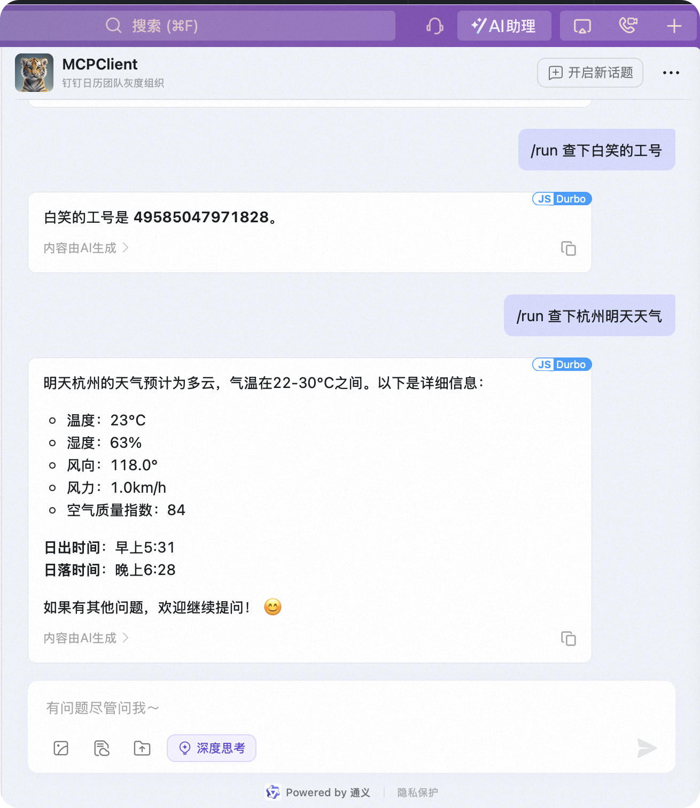

# DingTalk Agent Client

钉钉开放平台 API 客户端，支持用户认证、消息发送、用户查询等功能。

## 产品使用示例



## 功能特性

- 用户认证
  - 支持 OAuth2 授权
  - 支持用户访问令牌和刷新令牌管理
  - 支持企业应用访问令牌管理

- 用户管理
  - 用户搜索（支持精确匹配和模糊匹配）
  - 获取用户详细信息
  - 获取当前用户信息

- 消息发送
  - 支持文本消息
  - 支持 Markdown 消息
  - 支持 @ 用户和 @ 所有人

- MCP 工具集成
  - 用户查询工具
  - 消息发送工具
  - 天气查询工具
  - 订单信息提取工具
  - 其他实用工具

## 安装

1. 克隆项目
```bash
git clone https://github.com/yourusername/dingtalk-agent-client.git
cd dingtalk-agent-client
```

2. 安装依赖
```bash
pip install -r requirements.txt
```

3. 配置环境变量
```bash
cp .env.example .env
# 编辑 .env 文件，填入你的钉钉应用配置
```

## 配置说明

在 `.env` 文件中配置以下信息：

```env
# 钉钉应用配置
DINGTALK_APP_KEY=your_app_key
DINGTALK_APP_SECRET=your_app_secret
DINGTALK_BASE_URL=https://oapi.dingtalk.com/

# 数据库配置
DATABASE_URL=sqlite:///./app.db

# 日志配置
LOG_LEVEL=INFO
```

## 使用示例

### 1. 用户认证

```python
from app.api.auth.dingtalk_auth import DingtalkAuth

# 初始化认证对象
auth = DingtalkAuth()

# 获取用户访问令牌
access_token, refresh_token = auth.get_user_access_token(auth_code)
```

### 2. 发送消息

```python
from app.api.client.open.openapi_client import DingtalkClient

# 初始化客户端
client = DingtalkClient(auth)

# 发送文本消息
success = client.send_text_message(
    receiver_uid="user123",
    text="Hello, World!",
    at_user_ids=["user456"]
)
```

### 3. 查询用户

```python
# 搜索用户
users = client.search_users("张三", exact_match=True)

# 获取用户详细信息
user_info = client.get_users_info(["user123"])
```

### 4. 使用 MCP 工具

```python
from app.core.mcp_server import search_users, get_user_info, send_message

# 搜索用户
result = search_users("张三")

# 获取用户信息
result = get_user_info("user123")

# 发送消息
result = send_message("张三", "Hello, World!")
```

## API 文档

### DingtalkAuth 类

- `get_user_access_token(auth_code: str) -> Tuple[str, str]`
  - 获取用户访问令牌和刷新令牌

- `get_app_access_token() -> str`
  - 获取企业应用访问令牌

### DingtalkClient 类

- `search_users(query_word: str, exact_match: bool = False) -> List[str]`
  - 搜索用户，返回用户ID列表

- `get_users_info(user_ids: List[str]) -> List[Dict]`
  - 获取用户详细信息

- `send_text_message(receiver_uid: str, text: str, at_user_ids: Optional[List[str]] = None) -> bool`
  - 发送文本消息

- `send_markdown_message(receiver_uid: str, title: str, text: str, at_user_ids: Optional[List[str]] = None) -> bool`
  - 发送 Markdown 消息

## 开发指南

1. 代码结构
```
dingtalk-agent-client/
├── app/
│   ├── api/
│   │   ├── auth/
│   │   │   └── dingtalk_auth.py
│   │   └── client/
│   │       └── open/
│   │           └── openapi_client.py
│   ├── core/
│   │   └── mcp_server.py
│   └── config/
│       └── settings.py
├── static/
│   └── resource/
│       └── iShot_2025-04-18_21.30.37.png
├── tests/
├── requirements.txt
└── README.md
```

2. 添加新功能
- 在 `app/api/client/open/openapi_client.py` 中添加新的 API 方法
- 在 `app/core/mcp_server.py` 中注册新的 MCP 工具
- 添加相应的单元测试

## 贡献指南

1. Fork 项目
2. 创建特性分支 (`git checkout -b feature/AmazingFeature`)
3. 提交更改 (`git commit -m 'Add some AmazingFeature'`)
4. 推送到分支 (`git push origin feature/AmazingFeature`)
5. 创建 Pull Request

## 许可证

本项目采用 MIT 许可证 - 查看 [LICENSE](LICENSE) 文件了解详情

## 联系方式

- 项目维护者：[DarrenYao]
- 邮箱：[yao428650@gmail.com]


