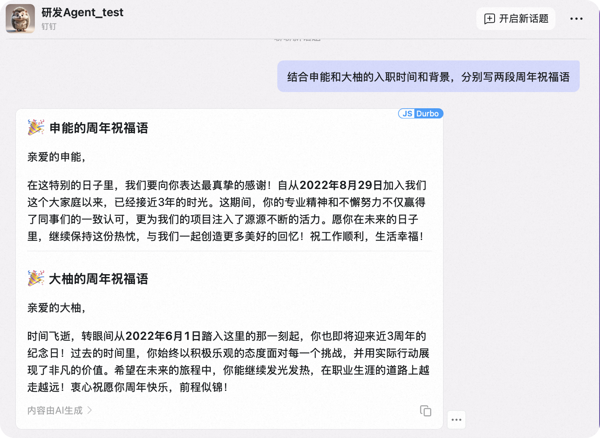
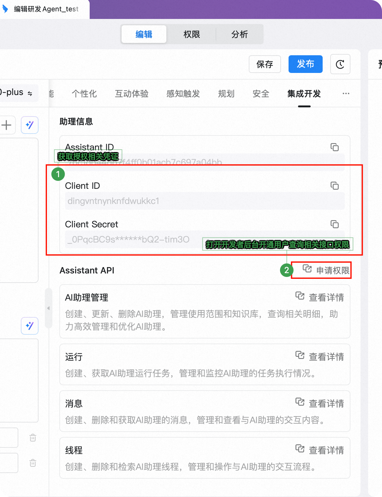
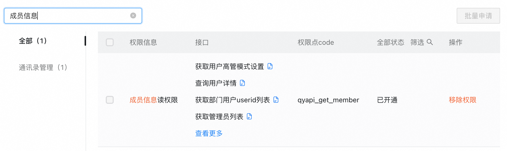
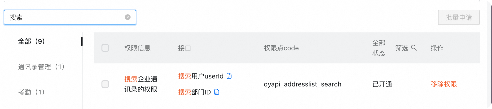

# 钉钉 Agent 开发SDK

支持集成各种 MCP-Server 快速开发钉钉 AI 助理


## 概述

本项目为在钉钉上构建 AI 助手提供了强大的基础，利用了以下技术：

- OpenAI Agent SDK 提供 AI 能力和推理功能
- 钉钉流式 API 实现实时消息处理
- MCP-server 集成访问钉钉组织数据, 可扩展更多能力
- 员工信息查询 Agent 示例展示平台能力

## 主要特性

- **OpenAI Agent 集成**：与 OpenAI 的 Agent 框架无缝集成
- **钉钉流客户端**：实现了健壮的连接重试和健康监控机制
- **消息处理管道**：结构良好的消息接收处理系统
- **MCP 工具集成**：通过钉钉 API 实现员工查询功能
- **可扩展架构**：易于添加新的 Agent 或功能

## 架构

系统由以下几个关键组件组成：

- **流客户端管理器**：管理与钉钉流式 API 的 WebSocket 连接
- **消息处理器**：处理传入消息并将其路由到相应的 Agent
- **Agent 管理器**：管理 OpenAI Agent 和工具集成
- **员工 Agent**：可以查询员工信息的示例 Agent

## 前提条件

- Python 3.10+
- 钉钉开发者账号及相应权限
  - 获取AI 助理的 Client_ID, Client_Secret
    
  - 开通基础接口的调用权限
    
    
- LLM调用的 api-key (默认使用百炼的qwen-max 服务， 可配置)

## 安装

1. 克隆仓库：
   ```bash
   git clone git@github.com:darrenyao/dingtalk-agent-client.git
   cd DingtalkAgentClient
   ```

2. 安装依赖：
   ```bash
   pip install -r requirements.txt
   ```

3. 创建包含配置的 `.env` 文件：
   ```
   # 钉钉 API 配置
   DINGTALK_CLIENT_ID=your_client_id
   DINGTALK_CLIENT_SECRET=your_client_secret

   # LLM API 配置
   LLM_API_KEY=your_llm_api_key
   LLM_API_BASE_URL=https://dashscope.aliyuncs.com/compatible-mode/v1  # 或您的自定义端点
   LLM_API_MODEL=qwen-max  # 或您首选的模型
   ```


## 运行应用

使用以下命令启动应用：

```bash
python main.py
```

系统将：
1. 初始化带有必要工具的 Agent
2. 连接到钉钉的流式 API
3. 监听传入消息
4. 通过相应的 Agent 处理消息

## 员工 Agent 示例

包含的 `employee_agent.py` 演示了如何：

1. 创建与钉钉组织 API 集成的 Agent
2. 使用 MCP-tool 查询员工信息
3. 基于用户上下文构建动态指令
4. 以对话形式处理并返回结果

## Docker 部署

您也可以使用 Docker 运行应用：

```bash
docker-compose up -d
```

## 扩展框架

创建新的 Agent：

1. 在 `app/agent` 目录中创建新的 Agent 文件
2. 定义 Agent 的指令和工具
3. 将 Agent 注册到 AgentManager
4. 更新消息处理以将适当的请求路由到您的 Agent

